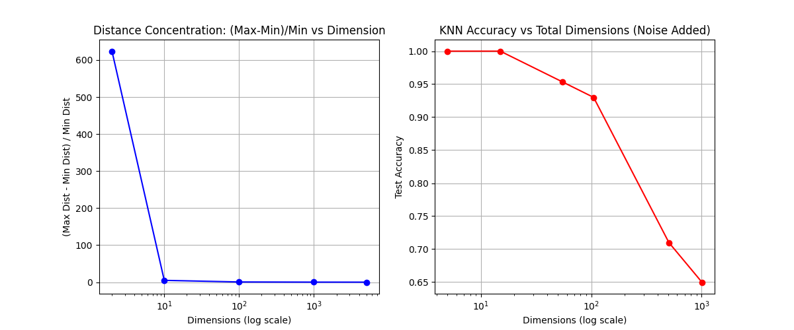

# Class 01: Dimensionality Reduction using Principal Component Analysis (PCA)

> **Core Principle:** "Simplifying complexity while preserving information"

---

## Table of Contents
1. [The Curse of Dimensionality](#1-the-curse-of-dimensionality)
2. [Principal Component Analysis: Theory](#2-principal-component-analysis-theory)
3. [Mathematical Formulation](#3-mathematical-formulation)
4. [Step-by-Step Example](#4-step-by-step-example)
5. [Implementation](#5-implementation)
6. [Exam Preparation](#6-exam-preparation)

---

## 1. The Curse of Dimensionality

### 1.1 The Fundamental Problem

**Analogy:** Imagine searching for a needle in different spaces:
- **1D (Line):** A 1-meter string - relatively easy to search
- **2D (Square):** A 1m × 1m rug - harder
- **3D (Cube):** A 1m × 1m × 1m haystack - very difficult
- **100D:** The search space becomes incomprehensibly vast

As dimensions increase, data points become increasingly sparse and distant from each other. This phenomenon severely impacts machine learning algorithms.

### 1.2 Mathematical Consequences

**Distance Concentration:** In high dimensions, the ratio between the maximum and minimum distances approaches 1:

$$\lim_{d \to \infty} \frac{\text{max\_dist} - \text{min\_dist}}{\text{min\_dist}} \to 0$$

This means all points appear equidistant, rendering distance-based algorithms (KNN, K-Means) ineffective.

**Volume Explosion:** The volume of a unit hypercube grows exponentially:
- 10 dimensions: $V = 1^{10} = 1$ (but surface area $= 20$)
- In high dimensions, almost all points lie near the surface

### 1.3 Visual Demonstration



**Key Observations:**
1. KNN accuracy degrades as dimensions increase
2. Distance measures lose discriminative power
3. Computational complexity explodes exponentially

---

## 2. Principal Component Analysis: Theory

### 2.1 Core Concept

**Geometric Intuition:** Consider photographing a flying eagle:
- **Front view:** You see a small black dot (low variance = low information)
- **Side profile:** You see wingspan, beak, tail (high variance = high information)

**PCA's Objective:** Automatically rotate the "camera" to find viewing angles that maximize variance (information).

### 2.2 Fundamental Properties

**Property 1: Variance Maximization**  
PCA finds orthogonal directions that maximize the variance of projected data.

**Property 2: Dimensionality Reduction**  
Original data: $\mathbb{R}^d \rightarrow$ Transformed data: $\mathbb{R}^k$ where $k < d$

**Property 3: Information Preservation**  
The first $k$ principal components retain the maximum possible variance for any $k$-dimensional linear projection.

### 2.3 Visual Representation

```
Original 2D Space              Principal Components           Projected 1D Space
     y                                y'                              
     |                                |                               
     |  * * *                         |  * * *                    * * * * *
     | * * * *        Rotate          | * * * *      Project      (All points
     |* * * * *    ---------->        |* * * * *   ---------->     on PC1)
     |  * * *                         |  * * *                    
     |______x                         |______x'                   
   (Diagonal spread)              (Aligned with PC1)          (Maximum variance)
```

---

## 3. Mathematical Formulation

### 3.1 Prerequisites

**Standardization (Mandatory Step):**

$$\mathbf{X}_{\text{scaled}} = \frac{\mathbf{X} - \boldsymbol{\mu}}{\boldsymbol{\sigma}}$$

**Why?** Without scaling, features with larger magnitudes will dominate the principal components purely due to scale, not information content.

### 3.2 Covariance Matrix

The covariance matrix captures relationships between features:

$$\mathbf{\Sigma} = \frac{1}{n-1} \mathbf{X}^T \mathbf{X}$$

For 2D data:

$$\mathbf{\Sigma} = \begin{bmatrix} \text{Var}(X_1) & \text{Cov}(X_1, X_2) \\ \text{Cov}(X_2, X_1) & \text{Var}(X_2) \end{bmatrix}$$

**Interpretation:**
- Diagonal elements: Individual feature variances
- Off-diagonal elements: Feature correlations

### 3.3 Eigenvalue Decomposition

**The Core Equation:**

$$\mathbf{\Sigma} \mathbf{v} = \lambda \mathbf{v}$$

Where:
- $\mathbf{v}$ = Eigenvector (direction of principal component)
- $\lambda$ = Eigenvalue (variance along that direction)

**Solution Process:**

1. **Characteristic Equation:**
   $$\det(\mathbf{\Sigma} - \lambda \mathbf{I}) = 0$$

2. **Solve for eigenvalues** $\lambda_1, \lambda_2, \ldots, \lambda_d$

3. **Solve for eigenvectors** corresponding to each $\lambda_i$

4. **Sort by magnitude:** $\lambda_1 \geq \lambda_2 \geq \ldots \geq \lambda_d$

### 3.4 Explained Variance Ratio

**Formula:**

$$\text{Explained Variance Ratio}_i = \frac{\lambda_i}{\sum_{j=1}^{d} \lambda_j}$$

**Cumulative Explained Variance:**

$$\text{Cumulative}_k = \frac{\sum_{i=1}^{k} \lambda_i}{\sum_{j=1}^{d} \lambda_j}$$

**Decision Rule:** Keep components until cumulative variance ≥ 90-95%

---

## 4. Step-by-Step Example

### 4.1 Dataset

| Sample | x    | y    |
|--------|------|------|
| 1      | 2.5  | 2.4  |
| 2      | 0.5  | 0.7  |
| 3      | 2.2  | 2.9  |
| 4      | 1.9  | 2.2  |
| 5      | 3.1  | 3.0  |

### 4.2 Step 1: Calculate Means

$$\mu_x = \frac{2.5 + 0.5 + 2.2 + 1.9 + 3.1}{5} = 2.04$$

$$\mu_y = \frac{2.4 + 0.7 + 2.9 + 2.2 + 3.0}{5} = 2.24$$

### 4.3 Step 2: Center the Data

Subtract means from each value:

| Sample | x - μ_x | y - μ_y |
|--------|---------|---------|
| 1      | 0.46    | 0.16    |
| 2      | -1.54   | -1.54   |
| 3      | 0.16    | 0.66    |
| 4      | -0.14   | -0.04   |
| 5      | 1.06    | 0.76    |

### 4.4 Step 3: Compute Covariance Matrix

$$\text{Var}(x) = \frac{1}{4}[(0.46)^2 + (-1.54)^2 + (0.16)^2 + (-0.14)^2 + (1.06)^2] = 0.616$$

$$\text{Var}(y) = \frac{1}{4}[(0.16)^2 + (-1.54)^2 + (0.66)^2 + (-0.04)^2 + (0.76)^2] = 0.716$$

$$\text{Cov}(x,y) = \frac{1}{4}[(0.46)(0.16) + (-1.54)(-1.54) + \ldots] = 0.615$$

$$\mathbf{\Sigma} = \begin{bmatrix} 0.616 & 0.615 \\ 0.615 & 0.716 \end{bmatrix}$$

### 4.5 Step 4: Find Eigenvalues

Solve: $\det(\mathbf{\Sigma} - \lambda \mathbf{I}) = 0$

$$\det\begin{bmatrix} 0.616 - \lambda & 0.615 \\ 0.615 & 0.716 - \lambda \end{bmatrix} = 0$$

$$(0.616 - \lambda)(0.716 - \lambda) - (0.615)^2 = 0$$

$$\lambda^2 - 1.332\lambda + 0.063 = 0$$

**Solutions:**
- $\lambda_1 = 1.284$ (96.3% of variance)
- $\lambda_2 = 0.049$ (3.7% of variance)

### 4.6 Step 5: Find Eigenvectors

For $\lambda_1 = 1.284$:

$$\begin{bmatrix} 0.616 - 1.284 & 0.615 \\ 0.615 & 0.716 - 1.284 \end{bmatrix} \begin{bmatrix} v_1 \\ v_2 \end{bmatrix} = \begin{bmatrix} 0 \\ 0 \end{bmatrix}$$

Solving yields: $\mathbf{v}_1 = \begin{bmatrix} 0.677 \\ 0.735 \end{bmatrix}$ (normalized)

### 4.7 Step 6: Project Data

Transform each point:

$$\text{PC1}_{\text{sample 1}} = (0.46)(0.677) + (0.16)(0.735) = 0.429$$

Final 1D representation: $[0.429, -2.167, 0.594, \ldots]$

---

## 5. Implementation

### 5.1 Python Implementation (Scikit-learn)

```python
import numpy as np
import matplotlib.pyplot as plt
from sklearn.preprocessing import StandardScaler
from sklearn.decomposition import PCA

# Load data (example: MNIST)
from sklearn.datasets import load_digits
digits = load_digits()
X, y = digits.data, digits.target

# Step 1: Standardization (MANDATORY)
scaler = StandardScaler()
X_scaled = scaler.fit_transform(X)

# Step 2: Apply PCA
pca = PCA(n_components=2)
X_pca = pca.fit_transform(X_scaled)

# Step 3: Analyze Results
print("Explained Variance Ratio:", pca.explained_variance_ratio_)
print("Cumulative Variance:", np.cumsum(pca.explained_variance_ratio_))

# Step 4: Visualization
plt.figure(figsize=(10, 6))
scatter = plt.scatter(X_pca[:, 0], X_pca[:, 1], c=y, cmap='tab10', alpha=0.6)
plt.xlabel('First Principal Component')
plt.ylabel('Second Principal Component')
plt.title('PCA: 64D → 2D Projection')
plt.colorbar(scatter)
plt.show()
```

### 5.2 Determining Optimal Components

```python
# Method 1: Cumulative Variance Plot
pca = PCA()
pca.fit(X_scaled)

cumsum = np.cumsum(pca.explained_variance_ratio_)
d = np.argmax(cumsum >= 0.95) + 1  # 95% threshold
print(f"Components needed for 95% variance: {d}")

# Visualization
plt.plot(cumsum)
plt.xlabel('Number of Components')
plt.ylabel('Cumulative Explained Variance')
plt.axhline(y=0.95, color='r', linestyle='--', label='95% threshold')
plt.legend()
plt.show()
```

---

## 6. Exam Preparation

### 6.1 Key Formulas Summary

| Concept | Formula | Notes |
|---------|---------|-------|
| Standardization | $z = \frac{x - \mu}{\sigma}$ | Always apply before PCA |
| Covariance | $\text{Cov}(X,Y) = \frac{1}{n}\sum(x_i - \bar{x})(y_i - \bar{y})$ | Measures linear relationship |
| Eigenvalue Equation | $\mathbf{\Sigma}\mathbf{v} = \lambda \mathbf{v}$ | Core PCA equation |
| Explained Variance | $\frac{\lambda_i}{\sum \lambda_j}$ | Percentage of info retained |
| Projection | $\mathbf{X}_{\text{new}} = \mathbf{X} \mathbf{V}_k$ | Transform to PC space |

### 6.2 Common Exam Questions

**Q1: Why is standardization necessary before PCA?**  
**Answer:** PCA is scale-dependent. Without standardization, features with larger numerical ranges will dominate the principal components due to higher variance, regardless of their actual information content.

**Example:** If Feature A is in kilometers (range 0-1000) and Feature B is in meters (range 0-1), Feature A will dominate PC1 purely due to scale.

**Q2: What is the difference between PCA and feature selection?**  
**Answer:**
- **PCA:** Creates new features (linear combinations of originals)
- **Feature Selection:** Chooses subset of original features
- PCA may lose interpretability but retains more information

**Q3: Can PCA be used for non-linear data?**  
**Answer:** Standard PCA only captures linear relationships. For non-linear structures (e.g., Swiss roll), use:
- Kernel PCA
- t-SNE
- UMAP
- Autoencoders

**Q4: How do you interpret the principal components?**  
**Answer:** Each PC is a weighted combination of original features:

$$\text{PC1} = 0.5 \cdot \text{Feature}_1 + 0.3 \cdot \text{Feature}_2 + \ldots$$

High absolute weights indicate important features for that component.

### 6.3 Numerical Problem Template

**Given:** Covariance matrix $\mathbf{\Sigma} = \begin{bmatrix} 4 & 2 \\ 2 & 3 \end{bmatrix}$

**Find:** Eigenvalues and eigenvectors

**Solution Steps:**
1. Set up: $\det(\mathbf{\Sigma} - \lambda \mathbf{I}) = 0$
2. Expand: $(4-\lambda)(3-\lambda) - 4 = 0$
3. Solve quadratic: $\lambda^2 - 7\lambda + 8 = 0$
4. Get eigenvalues: $\lambda = \frac{7 \pm \sqrt{17}}{2}$
5. Substitute back to find eigenvectors

### 6.4 Interview Questions

**Technical (Google/Amazon):**

**Q:** Explain the curse of dimensionality to a non-technical stakeholder.  
**A:** "Imagine searching for a specific book. In a small shelf (low dimensions), it's easy. In a library the size of a city (high dimensions), even with a map, most books are so far apart that finding patterns becomes impossible. We need to organize into fewer, meaningful categories."

**Q:** What's the computational complexity of PCA?  
**A:** $O(d^2 n + d^3)$ where:
- $d^2 n$: Computing covariance matrix
- $d^3$: Eigenvalue decomposition
For large $d$, use randomized PCA or incremental PCA.

**Mathematical (Quant Firms):**

**Q:** Why are eigenvectors orthogonal?  
**A:** For a symmetric matrix (like covariance), eigenvectors corresponding to distinct eigenvalues are orthogonal. This ensures principal components are uncorrelated.

**Proof sketch:**
$$\mathbf{\Sigma}\mathbf{v}_1 = \lambda_1\mathbf{v}_1, \quad \mathbf{\Sigma}\mathbf{v}_2 = \lambda_2\mathbf{v}_2$$
$$\mathbf{v}_1^T\mathbf{\Sigma}\mathbf{v}_2 = \lambda_2\mathbf{v}_1^T\mathbf{v}_2 = \lambda_1\mathbf{v}_1^T\mathbf{v}_2$$
$$(\lambda_1 - \lambda_2)\mathbf{v}_1^T\mathbf{v}_2 = 0 \implies \mathbf{v}_1^T\mathbf{v}_2 = 0$$

---

## Summary

**Key Takeaways:**
1. PCA transforms data to uncorrelated components ordered by variance
2. Eigenvectors define new axes; eigenvalues indicate importance
3. Always standardize data before applying PCA
4. Use explained variance ratio to determine component count
5. PCA is optimal for linear dimensionality reduction

**Limitations:**
- Assumes linear relationships
- Loses interpretability of original features
- Sensitive to outliers
- May not capture complex non-linear structures

**When to Use PCA:**
- Visualization (reduce to 2D/3D)
- Noise reduction
- Speed up training
- Combat multicollinearity
- Exploratory data analysis
