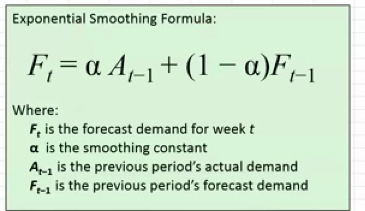

## Forecasting Methods / Smoothing Techniques :
- **Moving Averages**
- **Single Exponential Smoothing**
- **Double Exponential Smoothing**
- **Triple Exponential Smoothing (Holt-Winters)**

### Smoothing Techniques Explained:
- Reduce fluctuations in time series data to identify trends and patterns.
- Highlight long-term trends by minimizing the impact of short-term variations.
- Prepare data for more accurate forecasting.

### Moving Averages: 
-Pandas Functionality:
```python
import pandas as pd 
data['Moving_Average'] = data['Value'].rolling(window=3).mean()
``` 
Conclusion: Forecasting is certainly better than simple methods like mean and median but still has limitations in capturing complex patterns.

MAPE :0.94

### Single Exponential Smoothing:[only level component]

-  past values are given lasser weights.
- recently observed values are given more weight.

Let`s consider the weights we assign to most recent values is ''α'' (alpha) and the weights assigned to previous forecasted values is ''(1- α)''.

Mathematical Formula:- Forecast: \( F_{t+1} = \alpha \cdot A_t + (1 - \alpha) \cdot F_t \)
- where:
  - \( F_{t+1} \) = Forecast for the next period            
  - \( A_t \) = Actual value at time t
  - \( F_t \) = Forecast value at time t
  - \( \alpha \) = Smoothing constant (0 < α < 1)  
       

  Weights decrese exponentially as we go back in time.
  Never becomes zero.

  Sum of weights = 1.
  formula for sum weights: \( \alpha \cdot (1 - \alpha)^k \) where k is the number of periods back.


  Smoothing Constant (α):
- Determines the rate at which the influence of past observations decreases.
- Range: 0 < α < 1
- Higher α values give more weight to recent observations, making the forecast more responsive to changes.
Pandas Functionality:
```python
import statsmodels.api as sm
model = sm.tsa.SimpleExpSmoothing(data['Value']).fit(smoothing_level=0.2, optimized=False)
data['SES_Forecast'] = model.fittedvalues
```
Conclusion: Single Exponential Smoothing is effective for data with no trend or seasonality but may struggle with more complex patterns.

MAPE : 1.12

Shorting comings of ses:
- Does not account for trends or seasonality in the data.
- Gives equal weight to all past observations, which may not be ideal for all datasets.


### Double Exponential Smoothing:[level and trend component]
- Accounts for both the level and trend in the data.
Mathematical Formula:
- Level: \( L_t = \alpha \cdot A_t + (1 - \alpha) \cdot (L_{t-1} + T_{t-1}) \) 
- Trend: \( T_t = \beta \cdot (L_t - L_{t-1}) + (1 - \beta) \cdot T_{t-1} \)
- Forecast: \( F_{t+m} = L_t + m \cdot T_t \)
- where:
  - \( L_t \) = Level at time t
  - \( T_t \) = Trend at time t
  - \( A_t \) = Actual value at time t
  - \( F_{t+m} \) = Forecast for m periods ahead
  - \( \alpha \) = Smoothing constant for level (0 < α < 1)
  - \( \beta \) = Smoothing constant for trend (0 < β < 1)


  Seasonality is not considered in this method.

Pandas Functionality:
```python
import statsmodels.api as sm    
model = sm.tsa.ExponentialSmoothing(data['Value'], trend='add').fit(smoothing_level=0.2, smoothing_slope=0.1)
data['DES_Forecast'] = model.fittedvalues
```
Conclusion: Double Exponential Smoothing is suitable for data with trends but without seasonality, providing more accurate forecasts than Single Exponential Smoothing.


### Triple Exponential Smoothing (Holt-Winters):[level, trend and seasonal component]
- Extends Double Exponential Smoothing by adding a seasonal component.
Mathematical Formula:
- Level: \( L_t = \alpha \cdot \frac{A_t}{S_{t-m}} + (1 - \alpha) \cdot (L_{t-1 } + T_{t-1}) \)
- Trend: \( T_t = \beta \cdot (L_t - L_{t-1}) + (1 - \beta) \cdot T_{t-1} \)
- Seasonal: \( S_t = \gamma \cdot \frac{A_t}{L_t} + (1 - \gamma) \cdot S_{t-m} \)
- Forecast: \( F_{t+m} = (L_t + m \cdot T_t) \cdot S_{t-m+k} \)
- where:
  - \( L_t \) = Level at time t
  - \( T_t \) = Trend at time t
  - \( S_t \) = Seasonal component at time t                                    
    - \( A_t \) = Actual value at time t
    - \( F_{t+m} \) = Forecast for m periods ahead
    - \( \alpha \) = Smoothing constant for level (0 < α < 1)
    - \( \beta \) = Smoothing constant for trend (0 < β < 1)
    - \( \gamma \) = Smoothing constant for seasonality (0 < γ < 1)
    - m = number of periods in a season 
